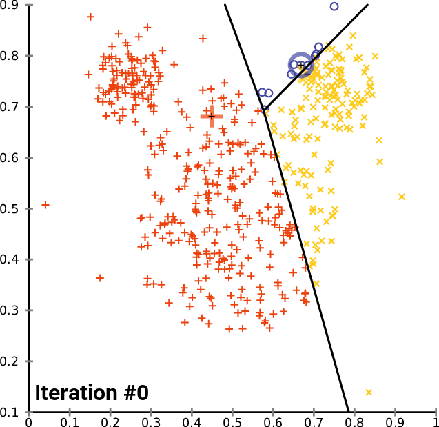

# Módulo 2: Aprendizagem de Máquina e Classificação / Module 2: Machine Learning and Classification

---

## Português
Este módulo aborda o fluxo de classificação de imagens de satélite no Google Earth Engine. O pipeline contempla o carregamento do mosaico pré-processado, uma etapa exploratória de agrupamento não supervisionado via K-Means, a geração de pontos amostrais aleatórios dentro de geometrias de interesse, a extração de atributos espectrais, o treinamento do classificador supervisionado Random Forest e a exportação do mapa final.

---

### Conceitos Fundamentais

#### 1. Agrupamento Não Supervisionado: K-Means
> O k-means é um algoritmo de agrupamento baseado em centroides iterativo, que divide um conjunto de dados em grupos semelhantes com base na distância entre seus centroides. O centroide, ou centro do cluster, é a média ou a mediana de todos os pontos dentro do cluster, dependendo das características dos dados.

O algoritmo K-Means é um método de aprendizagem não supervisionada cujo objetivo é particionar $N$ observações multidimensionais em $K$ agrupamentos distintos (*clusters*). Cada pixel no espaço de atributos espectrais é associado ao agrupamento cujo centróide apresenta a menor distância euclidiana:

$$\min \sum_{j=1}^{k} \sum_{i=1}^{n} \Vert{} x_i^{(j)} - c_j \Vert{}^2$$

No sensoriamento remoto, o K-Means serve como análise exploratória: identifica a estrutura intrínseca e os padrões espectrais naturais dos dados sem viés do operador e sem exigir polígonos de treinamento prévios.

<div align="center">
    
    <p>Convergence of k-means clustering from an unfavorable starting position (two initial cluster centers are fairly close)</p>
</div>

Para uma contextualização detalhada do funcionamento estatístico do K-means, consulte o vídeo: [StatQuest: K-means clustering](https://youtu.be/4b5d3muPQmA?si=0gfjcehjVrRFvkpf)[cite: 1].

#### 2. Classificação Supervisionada: Random Forest
O Random Forest é um algoritmo de aprendizagem supervisionada estruturado em um comitê de múltiplas árvores de decisão independentes. Ele introduz dois princípios de aleatorização para controlar sobreajuste (*overfitting*):
* **Bootstrap Aggregating (Bagging):** Cada árvore é treinada em um subconjunto aleatório das amostras obtido com reposição[cite: 1].
* **Aleatorização de Atributos (Feature Bagging):** Em cada nó de divisão da árvore, apenas um subconjunto aleatório de bandas preditoras (geralmente $\sqrt{M}$, onde $M$ é o número total de bandas) é avaliado[cite: 1].
* **Decisão por Maioria:** A classificação final de cada pixel resulta da moda (voto majoritário) das predições de todas as árvores individuais[cite: 1].

<div align="center">
    
    <p>Random Forests are a popular type of decision forest model. Here, you can see a forest of trees classifying an example by voting on the outcome.</p>
</div>

Para uma contextualização detalhada do funcionamento estatístico do Random Forest, consulte o vídeo: [StatQuest - Random Forest](https://youtu.be/J4Wdy0Wc_xQ)[cite: 1].

#### 3. Variabilidade Espectral Intra-classe e Estratégia de Amostragem
Variabilidade é o grau de dispersão ou agrupamento dos valores em um conjunto de dados[cite: 1]. No mapeamento de uso e cobertura da terra, uma mesma classe raramente possui assinatura espectral estática[cite: 1]:
* Corpos hídricos variam conforme profundidade, sedimentos em suspensão e proliferação de algas.
* Formações florestais e agroflorestais alteram sua reflectância de acordo com dossel, umidade foliar, sombreamento e sazonalidade.
* Áreas abertas (solo exposto/pastagem) oscilam drasticamente em função da compactação, matéria orgânica e ressecamento.

Uma amostragem adequada não deve coletar apenas "pixels puros centrais", mas precisa cobrir intencionalmente o gradiente ecológico e espectral da classe na área de estudo[cite: 1]. A distribuição de pontos aleatórios dentro de polígonos delimitados evita autocorrelação espacial local e garante amostras representativas[cite: 1].

---

### Execução no Google Earth Engine

#### 2.1 Carregamento do Mosaico
Carregamos o mosaico consolidado gerado na etapa anterior diretamente dos Assets do Earth Engine[cite: 1, 4].

```javascript
var imageId = 'projects/USER_PROJECT/assets/mosaic-tome-acu';
var mosaic  = ee.Image(imageId);
var visParams = {
  bands: ['swir1_median', 'nir_median', 'red_median'],
  min: 0.0347,
  max: 0.5702
};

Map.centerObject(mosaic, 10);
Map.addLayer(mosaic, visParams, 'Mosaico de Entrada');

```

---

#### 2.2 Análise Exploratória Não Supervisionada (K-Means)

Extraímos uma amostra estatística do mosaico sem rótulos (`mosaic.sample`) e treinamos o clusterizador `ee.Clusterer.wekaKMeans` para inspecionar os agrupamentos espectrais naturais da região.

```javascript
var unsupervisedSamples = mosaic.sample({
  region: mosaic.geometry(),
  scale: 30,
  numPixels: 30000,
  seed: 42,
  tileScale: 1
});

var clusterer = ee.Clusterer.wekaKMeans({
  init: 1,
  nClusters: 3,
  fast: false,
  seed: 42
}).train(unsupervisedSamples.limit(25000), mosaic.bandNames());

var clustered = mosaic.cluster(clusterer);
Map.addLayer(clustered.randomVisualizer(), {}, 'Agrupamentos K-Means', false);

```

---

#### 2.3 Coleta Vetorial Manual de Amostras

Utilizando a ferramenta de edição de geometrias do Code Editor, criamos polígonos para representar três classes:

1. `samples_veg`: Cobertura Vegetal (Atributo `class` = 1)


2. `samples_nonVeg`: Não Vegetação / Solo Exposto (Atributo `class` = 2)


3. `samples_water`: Corpos Hídricos (Atributo `class` = 3)


---

#### 2.4 Geração de Amostras Pseudoaleatórias Estratificadas

A função abaixo distribui $N$ pontos aleatórios dentro dos polígonos delimitados (`randomPoints`) e injeta a propriedade numérica `class` em cada vértice gerado:

```javascript
var generatePoints = function(polygons, nPoints) {
  var points     = ee.FeatureCollection.randomPoints(polygons, nPoints);
  var classValue = polygons.first().get('class');
  
  return points.map(function(point) {
    return point.set('class', classValue);
  });
};

var vegetationPoints    = generatePoints(samples_veg, 100);
var notVegetationPoints = generatePoints(samples_nonVeg, 100);
var waterPoints         = generatePoints(samples_water, 50);

var samples = vegetationPoints.merge(notVegetationPoints).merge(waterPoints);
print('Total de Amostras Coletadas:', samples);

Map.addLayer(samples.filter(ee.Filter.eq('class', 1)), {color: '#005b2b'}, 'Amostras - Vegetação');
Map.addLayer(samples.filter(ee.Filter.eq('class', 2)), {color: '#fff104'}, 'Amostras - Não Vegetação');
Map.addLayer(samples.filter(ee.Filter.eq('class', 3)), {color: '#1488ff'}, 'Amostras - Água');

```

---

#### 2.5 Extração dos Atributos Espectrais

Cruzamos as coordenadas amostrais com as bandas do mosaico usando `reduceRegions`. Empregamos o redutor `ee.Reducer.first()` por ser pontual e rápido, eliminando em seguida observações com valores ausentes causados por máscaras.

```javascript
var trainedSamples = mosaic.reduceRegions({
  collection: samples,
  reducer: ee.Reducer.first(),
  scale: 30
});

trainedSamples = trainedSamples.filter(ee.Filter.notNull(['blue_max']));
print('Amostras com Atributos Espectrais:', trainedSamples);

```

---

#### 2.6 Configuração e Treinamento do Random Forest

Instanciamos o classificador definindo 50 árvores (`numberOfTrees`) e o ajustamos utilizando a tabela de amostras e o vetor completo de variáveis explicativas (estatísticas temporais e índices).

```javascript
var classifier = ee.Classifier.smileRandomForest({
  numberOfTrees: 50
});

classifier = classifier.train({
  features: trainedSamples,
  classProperty: 'class',
  inputProperties: [
    'blue_max',   'blue_median',   'blue_min',
    'green_max',  'green_median',  'green_min',
    'red_max',    'red_median',    'red_min',
    'nir_max',    'nir_median',    'nir_min',
    'swir1_max',  'swir1_median',  'swir1_min',
    'swir2_max',  'swir2_median',  'swir2_min',
    'ndvi_max',   'ndvi_median',   'ndvi_min',
    'ndwi_max',   'ndwi_median',   'ndwi_min'
  ]
});

```

---

#### 2.7 Classificação e Visualização Cartográfica

Executamos o modelo treinado na imagem completa via `.classify()` e mapeamos os valores categóricos na visualização.

```javascript
var classification = mosaic.classify(classifier);
Map.addLayer(classification, {
  min: 1,
  max: 3,
  palette: ['#005b2b', '#fff104', '#1488ff'],
  format: 'png'
}, 'Classificação Supervisionada RF');

```

---

#### 2.8 Exportação da Classificação como Asset

Exportamos a classificação para os Assets. Para produtos categóricos discretos, a política de piramidação deve ser obrigatoriamente `mode`.

```javascript
Export.image.toAsset({
  image: classification,
  description: 'classification-tome-acu',
  assetId: 'classification-tome-acu',
  pyramidingPolicy: {'.default': 'mode'},
  region: classification.geometry(),
  scale: 30,
  maxPixels: 1e13
});

```

---

## English

### Core Concepts

#### 1. Unsupervised Clustering: K-Means

The K-Means algorithm is an unsupervised learning technique that partitions $N$ multi-dimensional observations into $K$ clusters. Each pixel feature vector is assigned to the cluster with the nearest centroid based on Euclidean distance:

$$\min \sum_{j=1}^{k} \sum_{i=1}^{n} \Vert{} x_i^{(j)} - c_j \Vert{}^2$$

In remote sensing workflows, K-Means serves as an exploratory tool: it detects the natural spectral distribution of the landscape without operator bias and without requiring predefined labeled training polygons.

#### 2. Supervised Learning: Random Forest

Random Forest is a supervised classification ensemble constructed from multiple uncorrelated decision trees. It relies on two main randomization principles to minimize overfitting:

* **Bootstrap Aggregating (Bagging):** Each tree is trained on an independently drawn bootstrap sample taken with replacement from the training set.


* **Feature Bagging:** At each internal node split, only a random subset of predictor variables (typically $\sqrt{M}$, where $M$ is total predictor count) is evaluated.


* **Majority Voting:** The overall model assigns the final categorical class via majority vote among all individual tree predictions.


For a visual breakdown of Random Forest mechanics, watch: [StatQuest - Random Forest](https://youtu.be/J4Wdy0Wc_xQ).

#### 3. Intra-class Spectral Variability and Sampling Logic

Variability measures how spread out or clustered numeric data observations are. In land use and land cover mapping, targets rarely exhibit fixed spectral values:

* Water bodies shift in reflectance depending on bathymetry, sediment load, and phytoplankton.
* Natural forests and agroforestry systems vary with crown density, canopy moisture, shadow geometry, and phenology.
* Non-vegetated surfaces (bare soil, fallow, pasture) vary according to organic matter, compaction, and seasonal moisture.

Sound sampling avoids restricting polygons to pristine, hyper-homogeneous spots. Distributing stratified pseudo-random points within broadly representative polygons ensures the classifier learns intra-class variance while minimizing spatial autocorrelation.

---

### Google Earth Engine Implementation

#### 2.1 Loading the Mosaic

We load the preprocessed composite asset produced during the previous module.

```javascript
// Define Asset ID
var imageId = 'projects/ee-marialuizesolvedcurso/assets/mosaic-tome-acu';
var mosaic = ee.Image(imageId);

// False-color visualization parameters (SWIR1, NIR, Red)
var visParams = {
  bands: ['swir1_median', 'nir_median', 'red_median'],
  min: 0.0347,
  max: 0.5702
};

Map.centerObject(mosaic, 10);
Map.addLayer(mosaic, visParams, 'Input Mosaic');

```

---

#### 2.2 Unsupervised Exploratory Clustering (K-Means)

We extract an unlabeled pixel sample (`mosaic.sample`) and fit an `ee.Clusterer.wekaKMeans` model to inspect the natural spectral clusters across the scene.

```javascript
// 1. Extract sample pixels from the mosaic grid
var unsupervisedSamples = mosaic.sample({
  region: mosaic.geometry(),
  scale: 30,
  numPixels: 30000,
  seed: 42,
  tileScale: 1
});

// 2. Configure and train K-Means clusterer (3 clusters)
var clusterer = ee.Clusterer.wekaKMeans({
  init: 1,
  nClusters: 3,
  fast: false,
  seed: 42
}).train(unsupervisedSamples.limit(25000), mosaic.bandNames());

// 3. Classify mosaic using clusterer
var clustered = mosaic.cluster(clusterer);
Map.addLayer(clustered.randomVisualizer(), {}, 'K-Means Clusters', false);

```

---

#### 2.3 Manual Polygon Delineation

Using the polygon drawing tool in the Code Editor, collect polygons representing three distinct classes:

1. `samples_veg`: Vegetation cover (`class` = 1)


2. `samples_nonVeg`: Non-vegetation / Bare soil (`class` = 2)


3. `samples_water`: Water bodies (`class` = 3)


---

#### 2.4 Stratified Random Sampling

The helper function below scatters $N$ pseudo-random points inside the polygons (`randomPoints`) and writes the integer `class` property to each point:

```javascript
// Helper function to sample random points within polygons
var generatePoints = function(polygons, nPoints) {
  var points = ee.FeatureCollection.randomPoints(polygons, nPoints);
  var classValue = polygons.first().get('class');
  
  return points.map(function(point) {
    return point.set('class', classValue);
  });
};

// Generate balanced point allocations
var vegetationPoints    = generatePoints(samples_veg, 100);
var notVegetationPoints = generatePoints(samples_nonVeg, 100);
var waterPoints         = generatePoints(samples_water, 50);

// Merge all classes into a single FeatureCollection
var samples = vegetationPoints.merge(notVegetationPoints).merge(waterPoints);
print('Total Training Points:', samples);

Map.addLayer(samples.filter(ee.Filter.eq('class', 1)), {color: '#005b2b'}, 'Samples - Vegetation');
Map.addLayer(samples.filter(ee.Filter.eq('class', 2)), {color: '#fff104'}, 'Samples - Non Vegetation');
Map.addLayer(samples.filter(ee.Filter.eq('class', 3)), {color: '#1488ff'}, 'Samples - Water');

```

---

#### 2.5 Spectral Extraction

We extract all predictor band values under the training points via `reduceRegions` using `ee.Reducer.first()`, then drop null values caused by masking artifacts.

```javascript
var trainedSamples = mosaic.reduceRegions({
  collection: samples,
  reducer: ee.Reducer.first(),
  scale: 30
});

// Drop observations where values are missing
trainedSamples = trainedSamples.filter(ee.Filter.notNull(['blue_max']));
print('Trained Samples with Spectral Features:', trainedSamples);

```

---

#### 2.6 Random Forest Training

We configure `ee.Classifier.smileRandomForest` with 50 trees and train the model using our sampled feature matrix and predictor list.

```javascript
// Configure Random Forest classifier
var classifier = ee.Classifier.smileRandomForest({
  numberOfTrees: 50
});

// Train the classifier
classifier = classifier.train({
  features: trainedSamples,
  classProperty: 'class',
  inputProperties: [
    'blue_max',   'blue_median',   'blue_min',
    'green_max',  'green_median',  'green_min',
    'red_max',    'red_median',    'red_min',
    'nir_max',    'nir_median',    'nir_min',
    'swir1_max',  'swir1_median',  'swir1_min',
    'swir2_max',  'swir2_median',  'swir2_min',
    'ndvi_max',   'ndvi_median',   'ndvi_min',
    'ndwi_max',   'ndwi_median',   'ndwi_min'
  ]
});

```

---

#### 2.7 Image Inference and Cartographic Display

We apply the fitted model across the mosaic using `.classify()` and render the thematic predictions using a discrete color palette.

```javascript
// Run classification inference
var classification = mosaic.classify(classifier);

// Add layer to map
Map.addLayer(classification, {
  min: 1,
  max: 3,
  palette: ['#005b2b', '#fff104', '#1488ff'],
  format: 'png'
}, 'Random Forest Classification');

```

---

#### 2.8 Exporting Discrete Thematic Map

We export the classified image to Earth Engine Assets using the `mode` pyramiding policy to preserve discrete categorical classes.

```javascript
Export.image.toAsset({
  image: classification,
  description: 'classification-tome-acu',
  assetId: 'classification-tome-acu',
  pyramidingPolicy: {'.default': 'mode'},
  region: classification.geometry(),
  scale: 30,
  maxPixels: 1e13
});

```