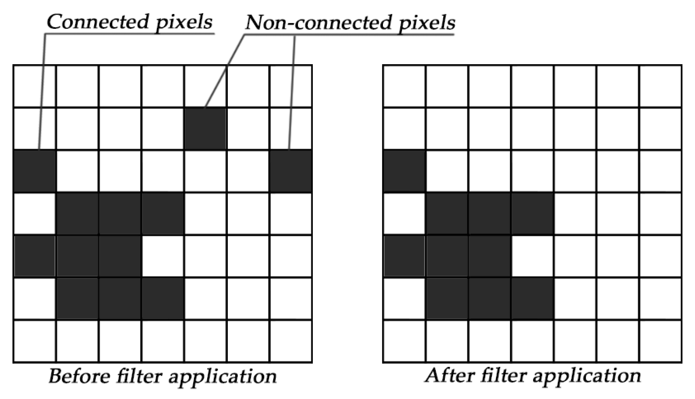
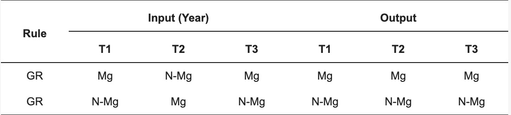
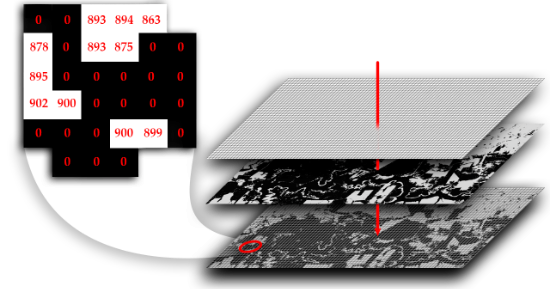

# Pós-classificação: Filtro Espacial, Filtro Temporal e Estatísticas de Área / Post-classification: Spatial Filter, Temporal Filter, and Area Statistics

---

## Português

### Conceitos do Módulo

#### 1. Ruído "Salt-and-Pepper" e Filtro Espacial de Maioria
Classificadores baseados em pixel frequentemente geram pequenos agrupamentos isolados ou pixels espúrios desconectados de sua matriz circundante (efeito "sal e pimenta"). 
O filtro espacial do apresentado resolve isso em duas etapas:
1. **Identificação de manchas isoladas (`connectedPixelCount`)**: Localiza agrupamentos contíguos de pixels da mesma classe menores que um limiar pré-estabelecido (`maxSize`).
2. **Reclassificação por moda local**: Aplica uma janela móvel de convolução 3x3 (`ee.Kernel.square(1)`) empilhada em bandas (`neighborhoodToBands`) e substitui o valor dos pixels isolados pela classe predominante da vizinhança (`ee.Reducer.mode()`).

<div align="center">
    
    <p>The spatial filter removes pixels that do not share neighbours of identical value. The minimum connection value was 10 pixels.</p>
</div>

#### 2. Consistência Lógica e Filtro Temporal
Classificações anuais independentes podem acusar transições ecologicamente impossíveis ou improváveis decorrentes de nuvens remanescentes ou variações sazonais de reflectância (ex.: Floresta $\rightarrow$ Pasto $\rightarrow$ Floresta em um intervalo de três anos).
O filtro temporal opera através de uma janela móvel ternária unidirecional ($T-1$, $T$, $T+1$). Se as extremidades apresentarem a mesma classe e o ano central diferir, o pixel central é reclassificado para corresponder à trajetória coerente.

<div align="center">
    
    <p>The temporal filter inspects the central position of three consecutive years, and in cases of identical extremities, the centre position is reclassified to match its neighbour.</p>
</div>

#### 3. Cálculo de Área Cartograficamente Correto
Superfícies elipsoidais não podem ser projetadas em planos euclidianos sem distorção métrica. Multiplicar a contagem de pixels pela resolução nominal (ex.: $30 \times 30\text{ m} = 900\text{ m}^2$) gera erros cumulativos graves em grandes extensões. No Google Earth Engine, a métrica exata é obtida pela projeção local de áreas equivalentes através da função `ee.Image.pixelArea()`, computando a área real de cada pixel geodésico em metros quadrados antes da agregação espacial (`reduceRegion`).

<div align="center">
    
    <p>Para ajudar a computar áreas, o Google Earth Engine possui o método `ee.Image.pixelArea()` que gera uma imagem na qual o valor de cada pixel é a área do pixel em metros quadrados. Logo é possível multiplicar.</p>
</div>

---

### Execução no Google Earth Engine

#### 3.1 Filtro Espacial: Remoção de Ruído por Objeto/Vizinhança

```javascript
var PostClassification = function (image) {

  this.init = function (image) {
    this.image = image;
  };

  var majorityFilter = function (image, params) {
    params = ee.Dictionary(params);
    var maxSize = ee.Number(params.get('maxSize'));
    var classValue = ee.Number(params.get('classValue'));

    var classMask = image.eq(classValue);

    // 2. Conta pixels conectados na mesma classe
    var labeled = classMask.mask(classMask).connectedPixelCount(maxSize, true);

    var region = labeled.lt(maxSize);
    var kernel = ee.Kernel.square(1);

    // Empilha vizinhança e mascara pela região de manchas espúrias
    var neighs = image.neighborhoodToBands(kernel).mask(region);

    var majority = neighs.reduce(ee.Reducer.mode());
    var filtered = image.where(region, majority);

    return filtered.byte();
  };

  this.spatialFilter = function (filterParams) {
    var image = ee.List(filterParams).iterate(
      function (params, image) {
        return majorityFilter(ee.Image(image), params);
      },
      this.image
    );

    this.image = ee.Image(image);
    return this.image;
  };

  this.init(image);
};

var classificationId = 'projects/USER_PATH/assets/classification-tome-acu';
var classification = ee.Image(classificationId);


var visClassification = {
  min: 1,
  max: 3,
  palette: ['#005b2b', '#fff104', '#1488ff'],
  format: 'png'
};

Map.centerObject(classification, 10);
Map.addLayer(classification, visClassification, 'Classificação Bruta');


var filterParams = [
  {classValue: 1, maxSize: 10},  
  {classValue: 2, maxSize: 10},  
  {classValue: 3, maxSize: 10}
];

var pc = new PostClassification(classification);
var filteredSpatial = pc.spatialFilter(filterParams);
filteredSpatial = filteredSpatial.reproject('EPSG:4326', null, 30)
Map.addLayer(filteredSpatial, visClassification, 'Classificação com Filtro Espacial');

```

---

#### 3.2 Filtro Temporal: Consistência entre Anos Consecutivos

```javascript
var class2024 = ee.Image('projects/USER_PATH/assets/classification-tome-acu-2024');
var class2025 = ee.Image('projects/USER_PATH/assets/classification-tome-acu-2025');
var class2026 = ee.Image('projects/USER_PATH/assets/classification-tome-acu'); // 2026

// Regras de transição
// Água (3) -> Vegetação (1) -> Água (3) => 2025 vira Água (3)
var rule1 = class2024.eq(3).and(class2025.eq(1)).and(class2026.eq(3));

// Não Vegetação (2) -> Vegetação (1) -> Não Vegetação (2) => 2025 Não Vegetação (2)
var rule2 = class2024.eq(2).and(class2025.eq(1)).and(class2026.eq(2));

var filtered2025 = class2025
  .where(rule1, 3)
  .where(rule2, 2);

Map.addLayer(class2025, visClassification, 'Classificação 2025 Bruta');
Map.addLayer(filtered2025, visClassification, 'Classificação 2025 Pós-Filtro Temporal');

```

---

#### 3.3 Cálculo Cartográfico de Área por Classe e Exportação

```javascript
var areaPerClass = function(img, classID) {
  var area = img
    .rename('area')
    .eq(classID)
    .multiply(ee.Image.pixelArea())
    .reduceRegion({
      reducer: ee.Reducer.sum(),
      geometry: img.geometry(),
      scale: 30,
      maxPixels: 1e13
    });

  return ee.Feature(null, {
    'classId': classID,
    'area_m2': area.get('area'),
    'area_ha': ee.Number(area.get('area')).divide(10000)
  });
};

var area_1  = areaPerClass(filteredSpatial, 1);
var area_2 = areaPerClass(filteredSpatial, 2);
var area_3 = areaPerClass(filteredSpatial, 3);

var areaCollection = ee.FeatureCollection([area_1, area_2, area_3]);
print('Resumo de Áreas Calculadas:', areaCollection);

// Exportar resultados como csv
Export.table.toDrive({
  collection: areaCollection,
  description: 'area_tome_acu_2026',
  fileNamePrefix: 'area_tome_acu_2026',
  folder: 'map_stats',
  fileFormat: 'csv'
});

```

---

## English

### Module Concepts

#### 1. Salt-and-Pepper Noise and Spatial Majority Filtering

Pixel-based classifications inevitably yield isolated spurious pixels or small pixel islands disconnected from their true physical landscape context ("salt-and-pepper" artifact).
The MapBiomas spatial filter implements a rigorous two-step post-processing strategy:

1. **Blob Identification (`connectedPixelCount`)**: Groups contiguous adjacent pixels sharing the same categorical class and flags islands smaller than a defined maximum threshold (`maxSize`).


2. **Local Majority Replacement**: Evaluates the spatial 3x3 window neighborhood (`ee.Kernel.square(1)`) flattened into image bands (`neighborhoodToBands`) and replaces the isolated pixels with the neighborhood's statistical mode (`ee.Reducer.mode()`).

<div align="center">
    
    <p>The spatial filter removes pixels that do not share neighbours of identical value. The minimum connection value was 10 pixels.</p>
</div>


#### 2. Temporal Logical Consistency

Independent annual classifications can produce ecologically impossible trajectories caused by cloud contamination, shadow remnants, or seasonal phenology (e.g., Forest $\rightarrow$ Pasture $\rightarrow$ Forest over three consecutive years).
The temporal filter scans time-series data using a unidirectional three-year moving ternary window ($T-1$, $T$, $T+1$). If the start and end years share the same class while the central year abruptly differs, the central pixel is reclassified to preserve temporal continuity.

<div align="center">
    
    <p>The temporal filter inspects the central position of three consecutive years, and in cases of identical extremities, the centre position is reclassified to match its neighbour.</p>
</div>

#### 3. Cartographically Accurate Area Calculation

Ellipsoidal surfaces cannot be projected onto planar coordinate grids without scale and area distortion. Simply multiplying pixel count by fixed grid spacing (e.g., $30 \times 30\text{ m} = 900\text{ m}^2$) creates cumulative errors over regional scales. In Google Earth Engine, area estimation must be conducted using `ee.Image.pixelArea()`, which computes the true geodesic surface area of each individual pixel in square meters before executing spatial reductions (`reduceRegion`).

<div align="center">
    
    <p>Para ajudar a computar áreas, o Google Earth Engine possui o método `ee.Image.pixelArea()` que gera uma imagem na qual o valor de cada pixel é a área do pixel em metros quadrados. Logo é possível multiplicar.</p>
</div>

---

### Google Earth Engine Implementation

#### 3.1 Spatial Filter: Object/Neighborhood Noise Cleaning

```javascript
var PostClassification = function (image) {

  this.init = function (image) {
    this.image = image;
  };

  var majorityFilter = function (image, params) {
    params = ee.Dictionary(params);
    var maxSize = ee.Number(params.get('maxSize'));
    var classValue = ee.Number(params.get('classValue'));

    var classMask = image.eq(classValue);

    // count contiguous connected pixels in the patch
    var labeled = classMask.mask(classMask).connectedPixelCount(maxSize, true);
    var region = labeled.lt(maxSize);

    // 3x3 square convolution kernel
    var kernel = ee.Kernel.square(1);

    // Flatten neighborhood into bands and mask to noise region
    var neighs = image.neighborhoodToBands(kernel).mask(region);
    var majority = neighs.reduce(ee.Reducer.mode());
    var filtered = image.where(region, majority);

    return filtered.byte();
  };

  this.spatialFilter = function (filterParams) {
    var image = ee.List(filterParams).iterate(
      function (params, image) {
        return majorityFilter(ee.Image(image), params);
      },
      this.image
    );

    this.image = ee.Image(image);
    return this.image;
  };

  this.init(image);
};

// Load classification asset
var classificationId = 'projects/USER_PATH/assets/classification-tome-acu';
var classification = ee.Image(classificationId);


var visClassification = {
  min: 1,
  max: 3,
  palette: ['#005b2b', '#fff104', '#1488ff'],
  format: 'png'
};;

Map.centerObject(classification, 10);
Map.addLayer(classification, visClassification, 'Raw Classification');

// Spatial filter parameter array (MapBiomas class ID and max pixel blob size)
var filterParams = [
  {classValue: 1, maxSize: 10},  
  {classValue: 2, maxSize: 10},  
  {classValue: 3, maxSize: 10}
];

// Instantiate and run filter
var pc = new PostClassification(classification);
var filteredSpatial = pc.spatialFilter(filterParams);

Map.addLayer(filteredSpatial.reproject('EPSG:4326', null, 30), visClassification, 'Spatial Filtered Map');

```

---

#### 3.2 Temporal Filter: Multi-year Rule Enforcement

```javascript
// Select chronological sequence (T-1, T, T+1)
var class2024 = ee.Image('projects/USER_PATH/assets/classification-tome-acu-2024');
var class2025 = ee.Image('projects/USER_PATH/assets/classification-tome-acu-2025');
var class2026 = ee.Image('projects/USER_PATH/assets/classification-tome-acu'); // 2026

// Define non-permitted trajectory rules
// Rule 1: Water (3) -> Vegetation (1) -> Water (3) => Correct 2025 to Water (3)
var rule1 = class2024.eq(3).and(class2025.eq(1)).and(class2026.eq(3));

// Rule 2: Non-vegetation (2) -> Vegetation (1) -> Non-vegetation (2) => Correct 2025 to Non-vegetation (2)
var rule2 = class2024.eq(2).and(class2025.eq(1)).and(class2026.eq(2));

// Apply conditional corrections on central year
var filtered2025 = class2025
  .where(rule1, 3)
  .where(rule2, 2);

Map.addLayer(class2025, visClassification, 'Classification 2025 (Raw)');
Map.addLayer(filtered2025, visClassification, 'Classification 2025 (Temporal Filtered)');

```

---

#### 3.3 Geodetic Area Calculation and CSV Export

```javascript
var areaPerClass = function(img, classID) {
  var area = img
    .rename('area')
    .eq(classID)
    .multiply(ee.Image.pixelArea())
    .reduceRegion({
      reducer: ee.Reducer.sum(),
      geometry: img.geometry(),
      scale: 30,
      maxPixels: 1e13
    });

  return ee.Feature(null, {
    'classId': classID,
    'area_m2': area.get('area'),
    'area_ha': ee.Number(area.get('area')).divide(10000)
  });
};

// Calculate area for Tomé-Açu target classes
var area_1  = areaPerClass(filteredSpatial, 1);
var area_2 = areaPerClass(filteredSpatial, 2);
var area_3 = areaPerClass(filteredSpatial, 3);

var areaCollection = ee.FeatureCollection([area_1, area_2, area_3]);
print('Area Extraction Results:', areaCollection);

Export.table.toDrive({
  collection: areaCollection,
  description: 'area_tome_acu_2026',
  fileNamePrefix: 'area_tome_acu_2026',
  folder: 'map_stats',
  fileFormat: 'csv'
});

```